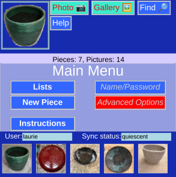
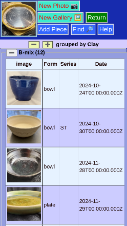

# potholder
Potter's database. Web based, phone friendly, visual, and free!

[Full documentation](https://alfille.github.io/potholder/index.html)

## Screen Shots:

 
 

## Code

* Author: Paul H Alfille
* License: MIT
* Language: Pure Javascript

