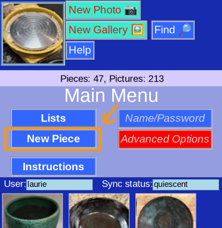
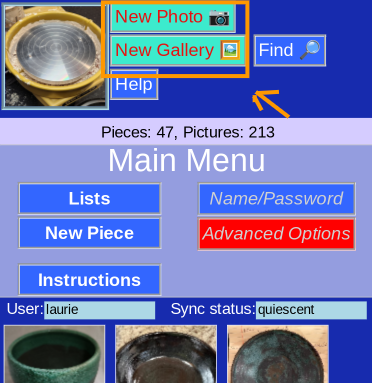

# Add a piece

Add a new creation to the database is one of the most important tasks.

There are 2 ways: Data-first or Picture-first. It depends on your prefered style.

## Data first

* Choose __New Piece__ from the [Main Menu](MainMenu.md) or [List Menu](ListMenu.md)
* Follow the directions for a [new piece](PotNew.md)

## Picture First

* Choose __New Photo__ (Camera) or __New Gallery__ (File) from the [Main Menu](MainMenu.md) or a number of other places
* Choose [New Piece](AssignPic.md) as the destination
