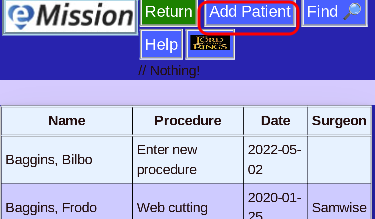
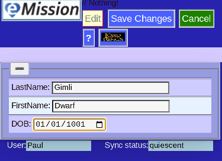
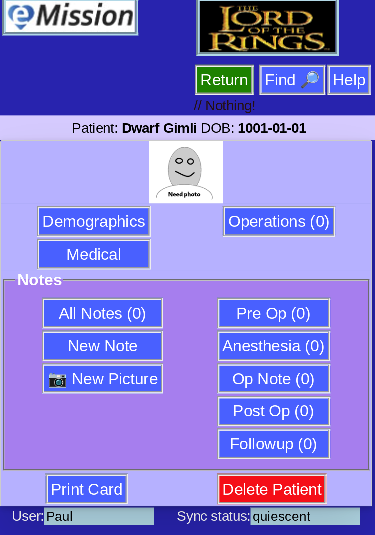
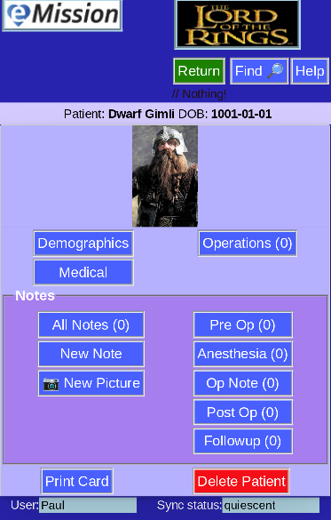
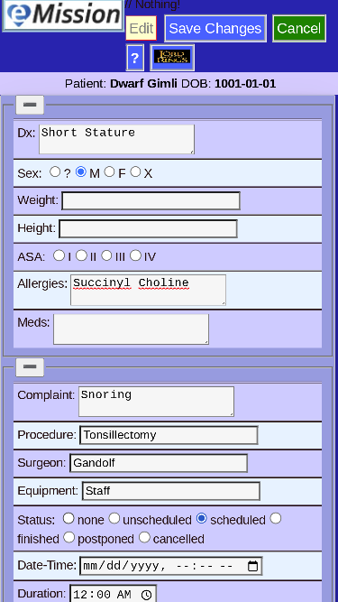
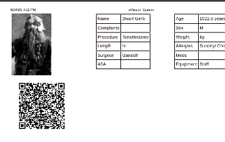

# Add A Patient

How do you add a new patient to the database?

* From the **Patient List** choose **Add Patient**

* Enter new patient identifiers

* **Save Changes**

* Choose **Demographics**

* Including a picture helps keeping records straight

* Choose **Medical** for information on health

* Medical info also includes fields for the operation

* **Save Changes** after completing record

* New patient entry is complete!

* If a printed tracking card is desired, choose **Print Card**

