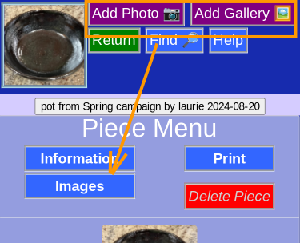

# Add Photo

## Button

__Add Photo__ Camera

__Add Gallery__ File(s) from your device gallery

## Action

The pictures are added to this piece.

You will see them immediately in [Images](PotPix.md) where you can:

* Add comments
* Crop
* Change order
* Delete

