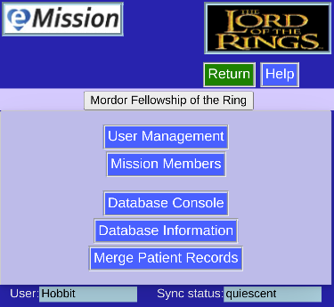

# Administration

The main administrative task menu

* **User Management**
  * for adding, editing, and deleting users
  * *needs SuperUser access*
* **Mission Members** 
   * to modify user access to your mission data
  * *needs SuperUser access*
* **Database Console** 
  * Direct database controls on the server
  * *needs SuperUser access*
* **Database Information** 
  * metadata provided by the database program
* **Merge Patient Records** 
   * specialized routine
 