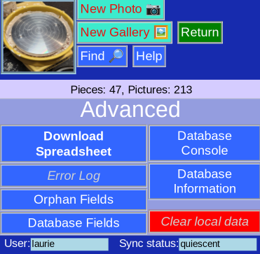

# Advanced Options

These are optional features of the program -- not needed for normal operation.

The explanations will be rather terse.

## Download Spreadsheet

Download data on all pieces in CSV-format (comma-separated-values). This format can be used by many programs including spreadsheets (Excel) and databases.

## [Error Log](ErrorLog.md)

Shows the error log

## Orphan Fields

A [table](Orphans.md) of fields in records that don't match the database schema.

## Database Fields

Show the various [database schema](StructMenu.md)

## Database Console

Access to [Fauxton](https://docs.couchdb.org/en/stable/fauxton/index.html), the server database console.

This allows raw edits of data records, permissions, and replicating the database to another server

## [Database Information](DatabaseInfo.md)

Information about the local copy of the database

## Clear local data

Clears local copy of the database and your locally stored credentials. Useful for switching device or clearing a borrowed or public device.

Note that data already synchronized with the server will be preserved.

