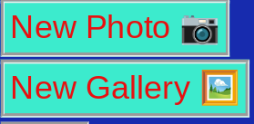

# Take a picture (Turquoise)

## Click the button

This picture button brings up either the camera (phone) or the gallery (laptop).

Since no piece is currently selected, you will have to choose the destination:

## Choose Destination

The choices are either

1. A new piece.
2. An existing piece. The picture will be added to the piece's other pictures.

