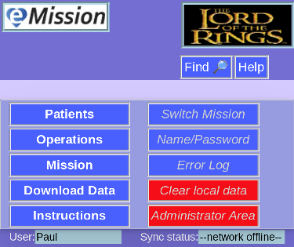
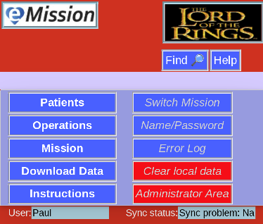

# Background Color

### Normal

Under normal conditions, **eMission**'s background is a lovely blue:

### Connection issue

If the network is disconnected, however (perhaps poor wifi coverage) the background changes to violet:

### Permission issue

And finally, if your credentials are incorrect (or the database name or web address are wrong) this is signaled by red:

More detail can be seen in the [Error Log](ErrorLog.html)