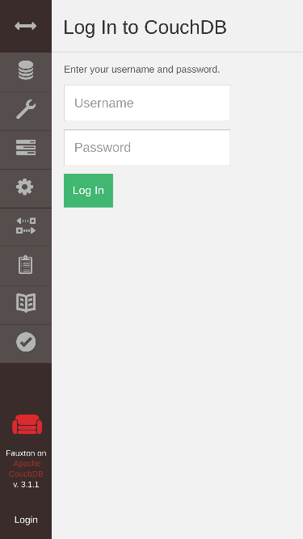
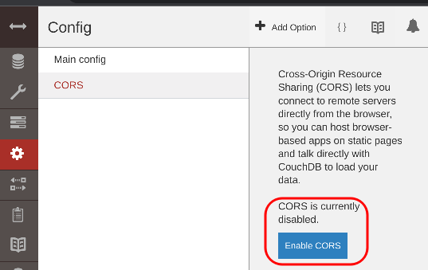
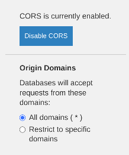

# CORS

There is one more step (besides adding databases, data and users) to allow eMission to function on your new server. 

### CORS background

For security, modern browsers restrict getting data from another website to protect users. [CORS](https://developer.mozilla.org/en-US/docs/Web/HTTP/CORS) or *Cross Origin Resource Sharing* is a protocol that helps negotiate that sharing.

Although your server is providing both the web content and database, since they use different TCP ports, we must enable CORS

### Admin Console

Use your web browser to go to __https://*domain-name*:6984/_utils/__ 

example: `https://eMissionsystem.org:6984/_utils`

Sign in with

* Username: admin
* Password: *database_password*

Go to __Settings__->__CORS__

Enable CORS for all domains (easiest)

