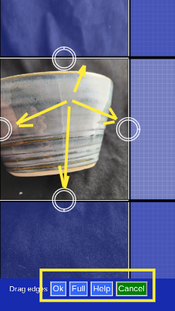

# Picture Cropping

Cropping is the process of honing in on the important part of a picture.

## Drag edges

To crop, drag the edges from the limits of the picture to hide unimportant background.

The cropped area is shaded blue.

## Non-destructive

Cropping will only change what is shown. The original full image is not changed and can be restored.

## Buttons

After cropping:

* __Ok__ when done
* __Full__ to restore the full picture (i.e. no cropping)
* __Help__ for this page
* __Cancel__ to not make a change

## Save Changes

You will need to actively save all your edits, including cropping, at the end, by pressing __Save Changes__