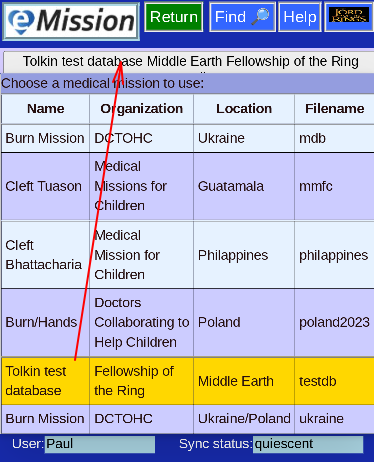

# Switch Mission

Although this shouldn't be a frequent occurrence, you can switch to a different mission.

Note the the current mission is highlighted, and shown in the top bar.

* You will need access permission to the new mission to get it's data
* You will need internet connectivity and time to download the new mission data
