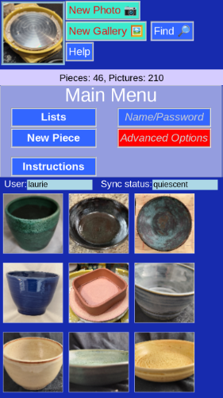
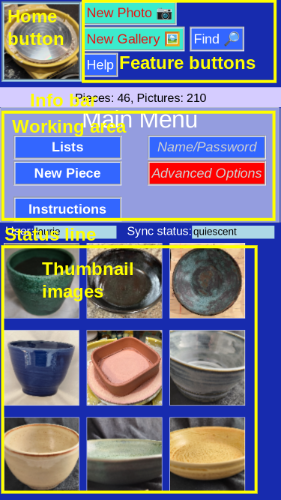
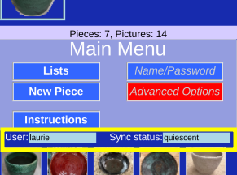

# Explaining the Display

Here is a typical page:

Each page in the program has some consistent elements:

## Home Button

The picture in the upper left hand corner will return you to the [_Main Menu_](MainMenu.md).

When a particular piece is selected, it's picture will be the one shown.

## Feature Buttons

These are specific to each page, but commonly include 
* _Help_ page-specific help
* [_Find_](Search.md) full text search
* [_New Photo_](Photo.md) to take a picture and create a new piece or add to an existing one
* [_New Gallery_](Photo.md) to select pictures already stored on your device

## Info Bar

Information about 
* the database as a whole
* the selected piece
* actions to take

## Working Area

This is the central focus of the page. It varies with each page, of course, but can be:
* Navigation buttons  

* Display/Edit fields  

* Lists  

## Status Line

Shows your user name, and what current network activity is occuring. (Usually _quiescent_). Click on sync status to see the [_error log_](ErrorLog.md).

Note that data is saved locally. It is also sent to the server (and vise versa) periodically. 

## Thumbnail buttons / Images

For pieces with a picture, the thumbnail is a fast way to click and select the piece. You can then [inspect and edit data](PotMenu.md) that piece.
