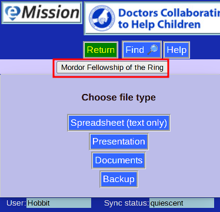

# Download Menu

There are a number ways to get Mission information in a form usable for other programs

* **Spreadsheet**
  * Useful as input into Excel
  * Pure text
  * CSV (comma-separated-values) format
* **Presentation**
  * Useful as PowerPoint input
  * PPTX format is a standard interchange
  * Presented as one record per slide
* **Archive**
  * Contains all non-text elements
  * Organized by patient
  * Zip format 
* **Backup**
  * This format is raw JSON
  * Usable as input into Couchdb and possibly others
  * Images are included as Base64 text 

