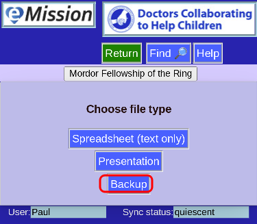
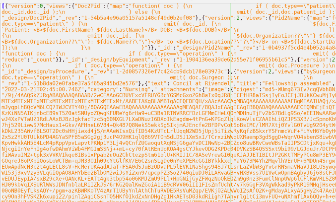

# Backup

This option downloads the entire database content in a standard JSON file format.

The information serves as a backup -- in can be loaded into the database program by a server administrator

Images are included as Base64 text -- so rather large

An example of the contents:

