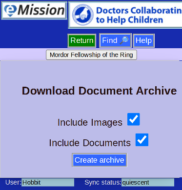
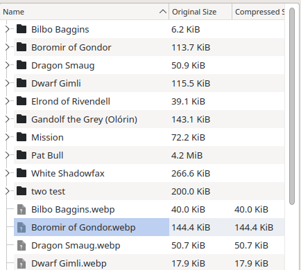

# Archive of Images and Files

This option creates a compressed archive of all the non-text material.

Specifically:

* Pictures
  * Patient ID pictures
  * Pictures in patient notes
  * Pictures in mission notes
* Included files from
  * patient notes
  * missoin notes
  

Inside the archive file

* Patient ID photos are in the root directory
* Each patient, and the mission itself, has a folder
  * Files are in the appropriate folder
  * Pictures are in the approprite folder, labeled by date.
