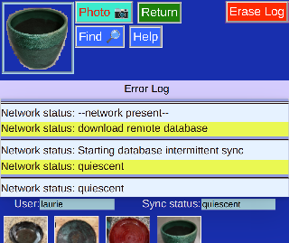

# Error Log

Note: This is an advanced internal view. It is not essential for using the program.

Basically the Error Log can be helpful for showing problems with the program or the network. Messages are shown one per line, with colored striping to help separate them.

_Erase Log_ will clear the messages, but cause no other issue.