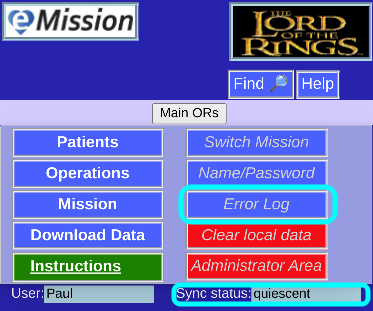
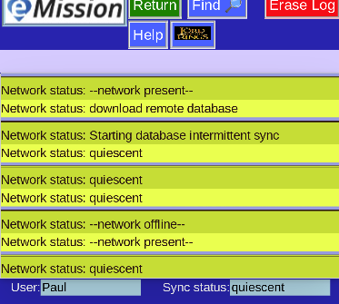

# Error Messages

When eMission seems to be acting strangely, it can be useful to view the error history and current status.

At the lower right corner is the current network status.

Click on that for the **Error Log**

(Or choose **Error Log** from the **Main Menu**)

This shows the status starting at oldest (top) and newest at the end of the list.

