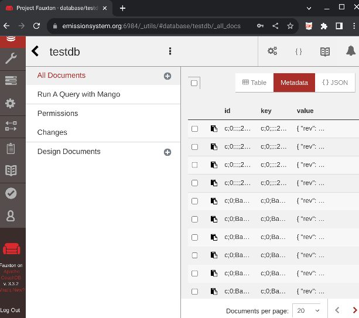

# Database Console

This is a link to the Couchdb database administration console on the remote server.

* Internet access is required
* Database Administration access (Superuser) is needed
* Expertise is needed. It is possible to make the whole eMission server not work.

### Possible reasons to use this console:

* Create a new mission database
* Edit Users, and permissions (although it is probably easier in the program)
* Direct inspection/editing of records
* Set up replication to a backup couchdb server