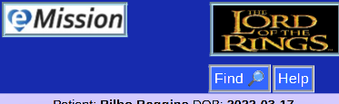
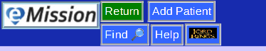

# Header

This is the top area of each page. In it's simplest form:

Which includes:

* **eMission Button** to reload the aplication and return to the Main Menu
* **Mission Logo** links to the organization's web site
* **Find** jumps to full text search through the mission database
* **Help** links to these instructions

On most pages, the Mission Logo will be smaller, and more options offered:

* **Return** usually returns to the previous page
* **Save**, **Edit**, **Add** may be choices depending on the context of the work area.