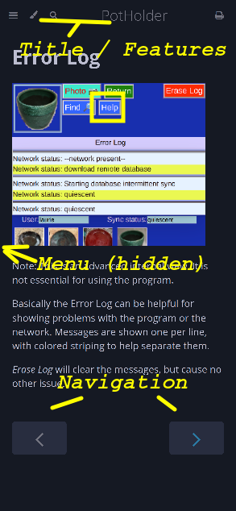
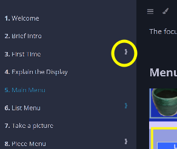

# Help

This _Help_ page describes the comprehensive _Potholder_ instructions.

_Help_ is shown in your browser using the common [_mdbook_](https://rust-lang.github.io/mdBook/) format.

## Display elements

This is typical page with several elements:

* Title and Features on top
* An example of the _Help_ button on every page
* Menu (hidden on smaller devices)
* Navigation buttons

## Context 

On each page of _Potholder_ the _Help_ button takes you to the specific Help section explaining that page.

## Feature Bar

Menu and search can be very useful.

## Menu

Opening the _menu_ icon shows the menu of help pages. Secondary menus can be expanded.
