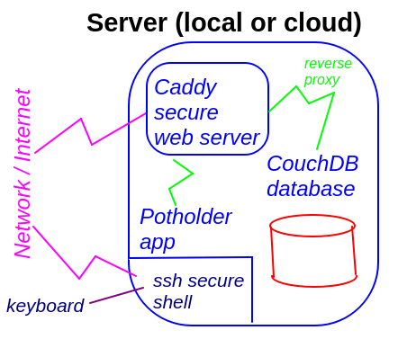

# Installation

We need to install the software components



## Platform

These instructions are for Linux, specifically [Debian version 12 _bookworm_](https://www.debian.org/).

Alternatives:
* Any linux -- [Ubuntu](https://ubuntu.com/download) is probably most similar
* Windows or Macintosh -- not tested
  * [Caddy](https://caddyserver.com/docs/install)
  * [Couchdb on Windows](https://docs.couchdb.org/en/stable/install/windows.html) and [Couchdb on Mac](https://docs.couchdb.org/en/stable/install/mac.html)
  * [OpenSSH on Windows](https://learn.microsoft.com/en-us/windows-server/administration/openssh/openssh_install_firstuse?tabs=gui&pivots=windows-server-2025) or [SSH on Mac](https://support.apple.com/guide/mac-help/allow-a-remote-computer-to-access-your-mac-mchlp1066/mac) 

## Command Line

All these steps (until database administration) or from the command line [terminal window](https://vitux.com/four-ways-to-open-the-terminal-in-debian/). You can either log in remotely via ssh, or open a "terminal window" if in a graphical environment (CTRL-ALT-T).

## Update system first

```
sudo apt update
sudo apt upgrade
```

## Install _git_

git is used to copy over the _Potholder_ code. It may already be installed.

```
sudo apt install git
```

## Install _caddy_

This is the secure web server.

```
sudo apt install caddy
```

## Install _couchdb_

This is the database program.

Using the [instructions](https://docs.couchdb.org/en/stable/install/unix.html) from their website (included below).

You will be asked if you want clustered or **Standalone** (choose standalone)

You will be asked for a cluster password. Choose anything.

The text to copy to the command line is rather extensive: 

```
# Prerequisites
sudo apt update && sudo apt install -y curl apt-transport-https gnupg

# Keys
curl https://couchdb.apache.org/repo/keys.asc | gpg --dearmor | sudo tee /usr/share/keyrings/couchdb-archive-keyring.gpg >/dev/null 2>&1 source /etc/os-release

# Repository
echo "deb [signed-by=/usr/share/keyrings/couchdb-archive-keyring.gpg] https://apache.jfrog.io/artifactory/couchdb-deb/ ${VERSION_CODENAME} main" | sudo tee /etc/apt/sources.list.d/couchdb.list >/dev/null

# Update source list
sudo apt update

# Install
sudo apt install couchdb
```

(Note that the # comments and blank lines are for readability)

## Install _potholder_

You will install using _git_ for the Github repository

```
cd /srv
sudo git clone https://github.com/alfille/potholder
```

## Installation is complete!

