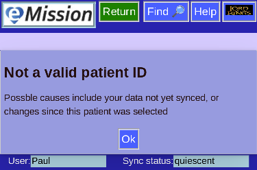

# Bad Patient

Occasionally you may see an error page like this:

As the page says, this occurs when there is a request for data that is not in the database.

* New entries not yet uploaded and distributed
* Patient refers to a deleted record

Press **Return** and select a different patient