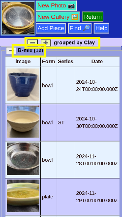
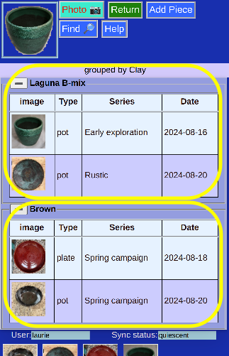
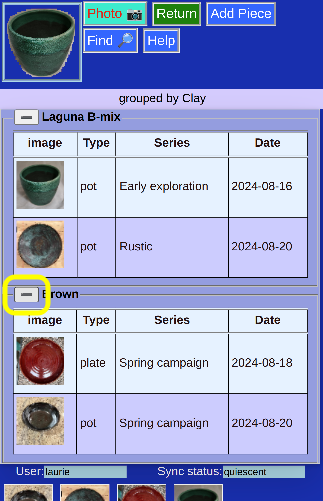
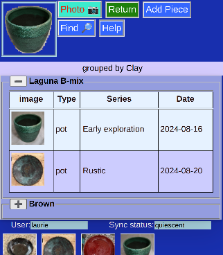

# Grouped List

Rather than one long list, your pieces can be listed by _Groups_ like "Clay", "Glaze", "Series", "Firing", etc. The available choices are seen in the [_List Menu_](ListMenu.md).

### Groups

You can see this grouping is by "Clay," and the name of each clay found is shown.

### Separate Lists

 

Each group is a separate table. You can select a piece to inspect or edit by clicking on it's row in the table.

### Hiding Tables

It is possible to hide or show any of the tables by clicking the "+" "-" button.

### Hidden

Here the "Brown Clay" table is hidden.

### Sortable

Like the [_All Pieces Table_](AllPieces.md), each table is sortable by clicking on a column heading.