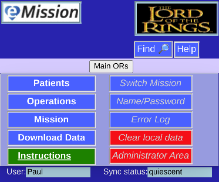

# Main Menu

This is the main menu page.

The menu choices are in the center of the page.

## Frequent Options (Left side)

* **Patients** Sortable list of all patients in the system
* **Operations** Sortable list of surgical operations performed or planned.
*  **Mission** Information and notes on this Mission
*  **Download Data** Export all data in various formats
*  **Instructions** Link to Help System

## Less Frequent (Right side)

* **Switch Mission** Use a different Mission database
* **Name/Password** Enter your credientials
* **Error Log** See current status report
* **Clear local data** Wipe Mission data off this device
* **Administrator Area** Edit Mission menbership and manage some database options

### eMission button

The eMission Logo button  in the upper corner of all pages should take you to this Main Menu
