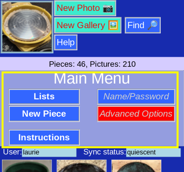

# Main Menu

The __Main Menu__ is the primary point for navigating to the many program features. The _Home_ button (upper left icon) always takes you here.

The _Main Menu_ page shares all the features of the standard [_Page Display_](Display.md) with feature buttons on top, status and Thumbnails.

The focus of the page is:

## Menu Choices

* [_Lists_](ListMenu.md) of your pieces organized in different ways
* [_New Piece_](PotNew.md) to create an entry for a new piece
* [_Instructions_](https://alfille.github.io/potholder/) for overall help
* [_Name/Password_](RemoteDatabaseInput.md) to modify your credentials to the database or generate a web link
* [_Advanced Options_](Administration.md) informational but not normally needed in general usage

In addition, you can click any of the thumbnail images to select that piece quickly.
