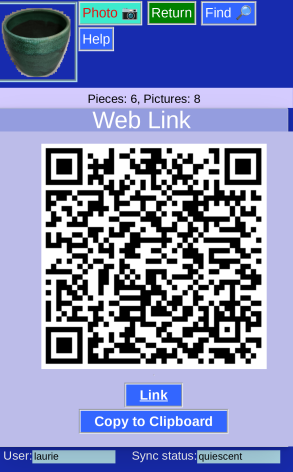

# Web Link

An option from either the [Advanced Menu](Administration.md) or the [Credentials](RemoteDatabaseInput.md) pages. The Web link holds
* Your username
* Your password (!)
* The database server location
* The database name

It's a web location and can be:

* Scanned as a QR code
* Clicked as a link
* Copied to the clipboard

In this case, the wrong information was entered, for security.
 