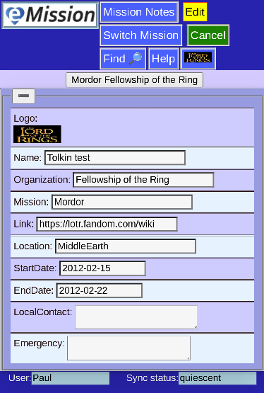

# Mission Information

Each mission (which can span several years) should have general information included.

Pressing **Edit** lets you add important items (like the logo which helps branding and quick identification)

Other options include

* **Mission Notes** Notes and photos that apply to the whoe mission rather than a particular patient
* **Switch Mission** change the database for another one

Remember to **Save Changes** if you are satisfied with your entries

