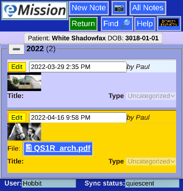
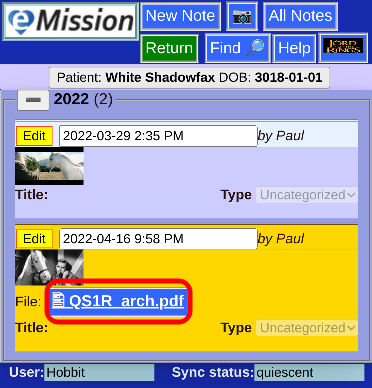
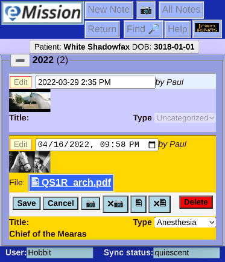
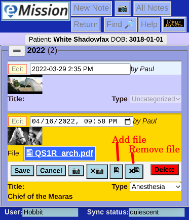

# Add Documents

Notes can also include an attached document (as well and text and picture).

When a document is stored in a note, it will appear in the *File* line.

### Appearance

You can click on the document to download it.

### Adding/Deleting documents

When editing a note (press the **Edit** button)

There are some special buttons for adding and removing the document.

