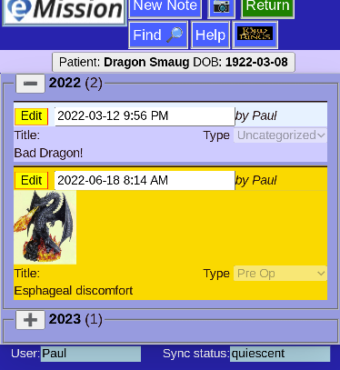
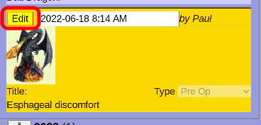
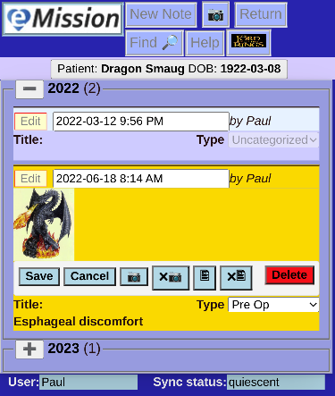
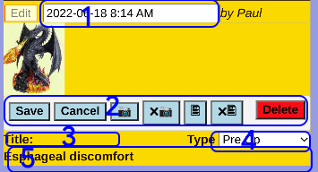

# Edit A Note

Notes (and associated pictures) form an important element of the medical record. Notes are linked to a specific patient (or the mission experience).

To edit an existing note, first select a note from the list:

Click **Edit** on the note you want to edit:

___

Two things happened:

* Many of the Header options are disabled during editing
* The note's display has changed, adding editing controls.

1. The date field can be altered. It defaults to the date of note creation.
2. A set of control buttons are displayed:
  * **Save** your changes (and finish the edit)
  * **Cancel** any changes
  * **Camera** Add or change the picture
  * **xCamera** Remove the picture
  * **Document** Add or change an attached file
  * **xDocument** Remove the attached file
  * **Delete** remove the entire note. 
3. The Note title can be edited
4. The note category (e.g. Preop, Postop, ...) can be chosen
5. The note text can be changed. This is free form text of any length
