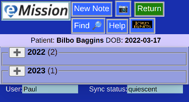
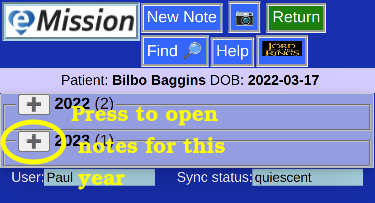
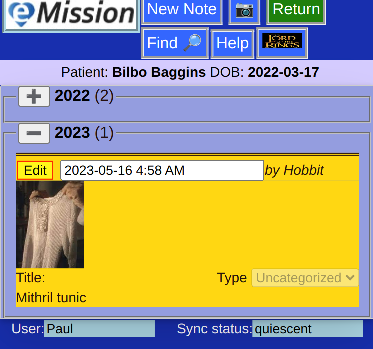

# Note List

Use this page to view existing notes.

* The notes will be on the patient shown in the Patient Bar
* Depending on which list was chosen, this can be all notes, or just a certain category (like "Pre-Op")
* There are buttons to add a new note or photo in the page header.

## Multiple years

* If more than one year is represented in the notes, (i.e. subsequent missions or yearly followup) the note list will be presented collapsed
* The year and the number of notes in that year is shown
* Click on the "+" button to open a given year

## Single year, or year selected

* For a single year, the note list is aleady expanded
* Each note can be read directly
* To edit the note, press the "Edit" button