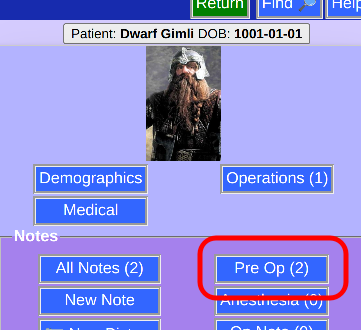

# Note List -- Single Type

You can view notes of a single kind from the [Patient Menu](PatientPhoto.html)

This brings the list of notes (notice that they are all "Pre-Op" in this case) that can be [edited](NoteEdit.html)

To "break out" and see all notes. choose **All Notes**

Also a **New Note** will be of this type (Pre-Op) by default.
