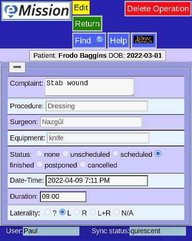
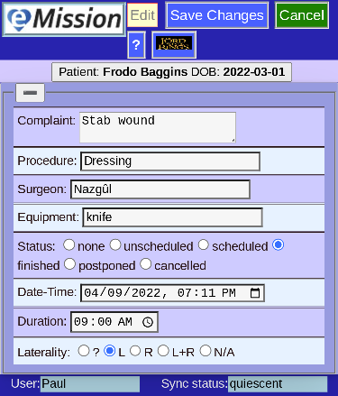

# Operation Edit

Choosing an operation will show the details

You have the options to **Delete Operation** or **Edit**

Once editing, the choices change. **Save Changes** to keep your work, or **Cancel** to make no change.
