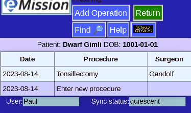

# Operation List (for a specific patient)

From the **Patient Menu**, **Operations** will give a list of operations.

* Click on the operation to review or edit
* Use the placeholder *Enter new procedure* to add an operation 