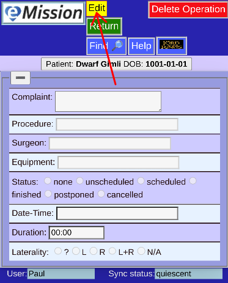
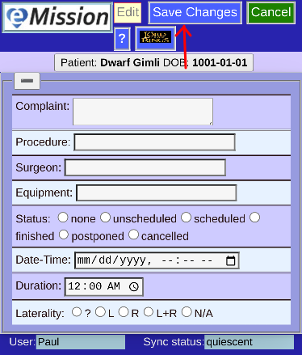

# New Operation

Adding an operation is a choice from the patient's **Operation List**

It's also possible to add an operation directly when inputting medical information on a new patient.

Basically a blank operation needs to be edited (press **Edit**)

**Save Changes** when done
