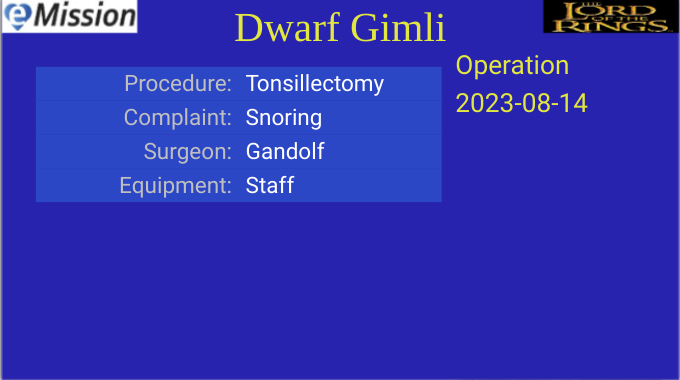

# Operations

* Operations are a key part of many medical missions.
* Operations planned or performed should be entered
* Several fields are available (equipment, surgeon, laterality, ...)
* More detail and photos should be added as notes, e.g.
  * Operative Notes
  * Preop Notes
  * Followup
* If no operation was yet done of planned, an placeholder operation *Enter new procedure* will be present