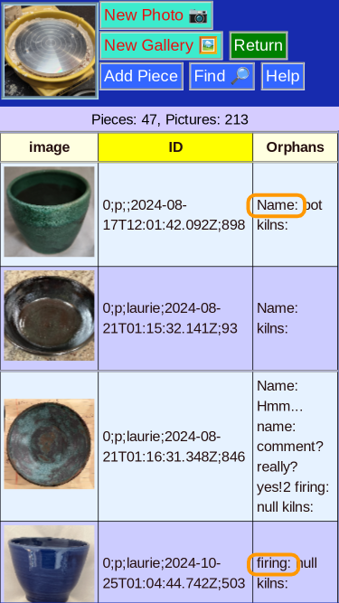

# Orphan Fields

This shows records with fields that are not in the [current schema](StructMenu.md) for the database.

Typically this shows old fields from prior design.

Will be useful if you change the schema.