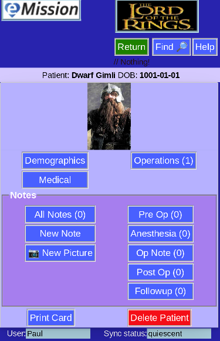

#  Overview of eMission 

## Summary

eMission is a simple patient database for use by humanitarian medical missions.

* It works on most smart phones
* It works even with bad cell service or intermittent wifi
* It's really easy to use
* It's easy to add photos and documents
* The team can share the information
* Security is build in

## Examples:

*To preserve patient confidentiality, only fictional characters are shown*

### Main Menu:

You start from the **Main Menu** which is the jump-off point for patient records as well as some bookkeeping options.

### Operation list:

One way to choose a patient is to pick from the list of scheduled or completed operations.

### Patient menu:

Here is an example of a particular patient. You can see the operation, and enter followup pictures and updates.

