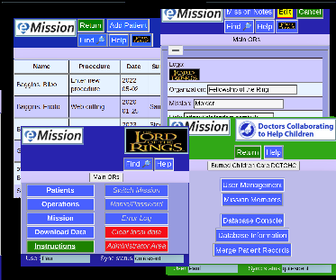

# Page Details

eMission is presented as separate pages (or screens if you prefer)

* The pages have a [common structure](Layout.html)
* Navigation is with [menus](MainMenu.html)
* Pages cover
  * [Patients](Patient.html)
  * [Operations](Operations.html)
  * [Notes](Notes.html)
  * [Exporting](Download.html) and [Search](SearchList.html)
  * And more advanced [Administration](Administration.html)