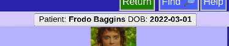

# Patient Bar

Just under the Header is the Patient Bar

This shows the current selected patient which is especially useful when viewing notes and operations.

When editing Mission information, the Mission Name will be shown instead.