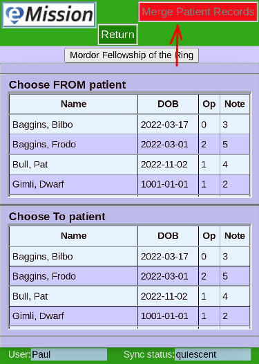
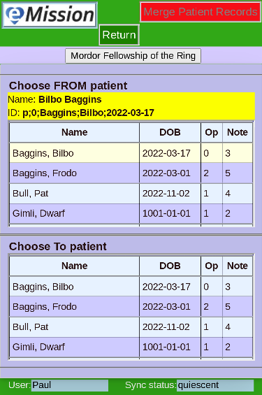
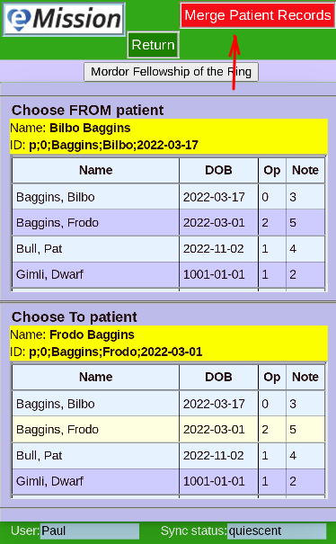

# Merge Patient Records

This is a specialized procedure best left to the mission expert.

Sometimes the same patient was entered twice with slightly different identifiers.

* Two lists of patients are shown (from the mission records)
* The **Merge Patient Records** button is disabled

When a patient is chosen, the Name and record id is shown

In this case, Bilbo is a considered a duplicate patient name and we will next choose the patient to move the data to.

Now a **From** and **To** id have been chosen. The **Merge Patient Records** button is enabled. 

**Return** to change your mind.