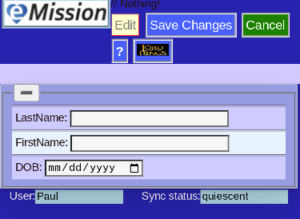

# New Patient

This page is for the initial patient creation. The 3 elements:

* Last name
* First name
* DOB (date of birth)

Are for creating a unique internal ID identifying the patient's records.

A complete description for adding a new patient with all the steps including adding information, a picture and any planned procedures is found under **Tasks** in the Help Documentation.
