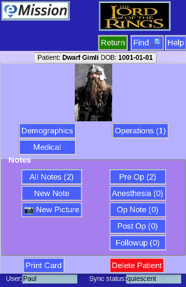

# Patient Menu

This is the main page for each patient. There are a number of choices:

* Patient information
  * **Demographics** gives age, sex, and contact information
  * **Medical** for medications, allergies
* **Operations**
  * The number of operations is shown
  * button advances to a list of the operations, and the change to add, delete or edit
* Notes
  * **All Notes** shows the total number, and a full list of notes
  * **New Note** and **New Pciture** are quick ways to add new content
  * Note categories like **Pre Op**, **Followup** etc show the number in each category, and allow seeing a specific list
* **Print Card** to print a page with patient summary and a bar code link for easy patient management
* **Delete Patient** to eliminate this patient and all associated operations and notes

