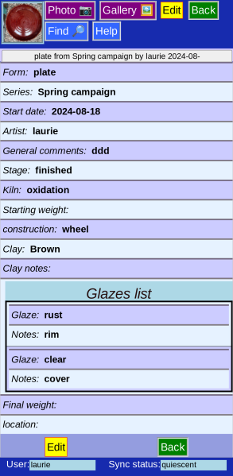
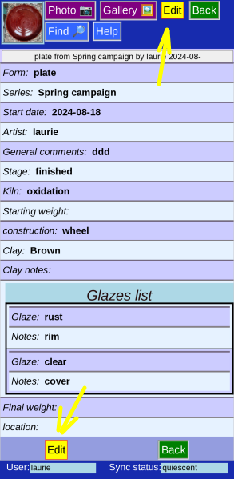
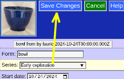
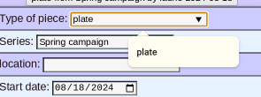
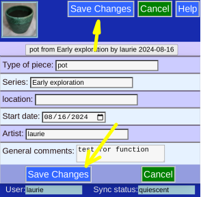
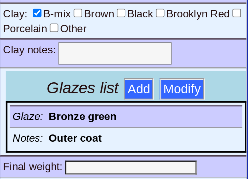
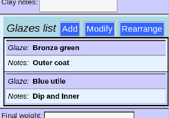
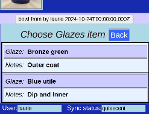
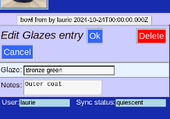
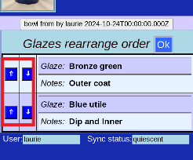

# Edit Piece -- General Information

This page hold general information about the piece, including the type, artistic series, current location and date and production process.

## View

For Safety, the page starts out in *View mode*. You can swiitch to *Edit mode* by clicking the __Edit__ button, or double-tapping the data.

## Edit

When editing, all the fields can be changed. The __Save Changes__ button is initially inactive, until a change is made.

## Save Changes

After a change is made, you must __Save Changes__ or __Cancel__ to keep or discard your work.

## Field types

* List -- Either a list of prior entries, or you can enter something new.
* Date -- Click the calender for a visual display
* Text -- comments can be free text of any length (All searchable, of course)
* Radio -- mutually exclusive choices
* Checkbox -- Choose one or more
* List -- Variable length list of repeated fields

## List Add

Adding to a list shows the fields in this list entry. __Pk__ to continue.

## List Add or Modify

With at least one intry in the list, more options appear.

## List Choose

With 2 or more, another option __Rearrange__ appears as well. If we want to edit one ot the entries, we will get a chace to choose which one:

Click on your entry choice to proceed.

## List Modify

Edit the entry, or even __Delete__ it entirely

## List Rearrange

You can also change the order the list entries appear in with the arrows.
