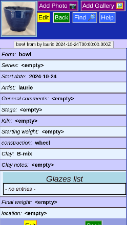
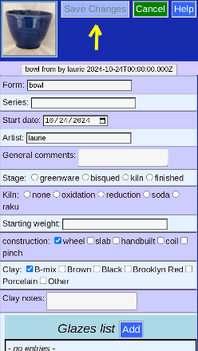

# Edit Piece -- General Information

This page hold general information about the piece, including the type, artistic series, current location and date and production process.

## Edit

Click the _Edit_ button (either one) to allow changing data. Double-clicking data should work as well.

## [Editing](PotProcess.md)
