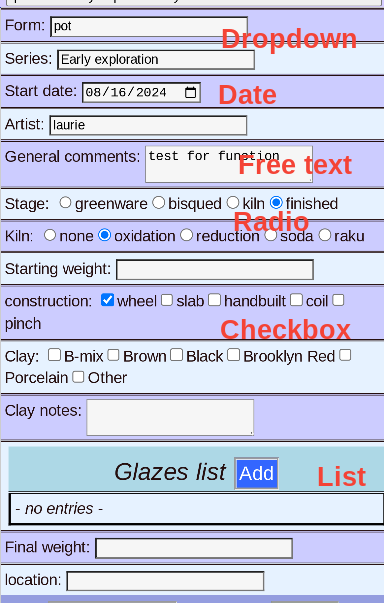

# Edit Piece -- General Information

This page hold general information about the piece, including the type, artistic series, current location and date and production process.

## View

For Safety, the page starts out in *View mode*. You can swiitch to *Edit mode* by clicking the __Edit__ button, or double-tapping the data.

## Edit

When editing, all the fields can be changed. The __Save Changes__ button is initially inactive, until a change is made.

## Save Changes

After a change is made, you must __Save Changes__ or __Cancel__ to keep or discard your work.

## Field types

* Dropdown -- Either a list of prior entries, or you can enter something new
* Date -- Click the calender for a visual display
* Free Text -- comments can be of any length (All searchable, of course)
* Radio -- mutually exclusive choices
* Checkbox -- Choose one or more
* List -- Variable length list of repeated fields

## List

The [List type](PotEditList.md) has more options to _Add_, _Modify_, _Delete_ and _Rearrange_ the entries.

## Save

Click __Save Changes__ to save your work.