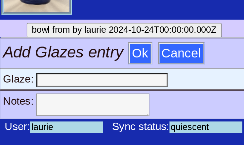
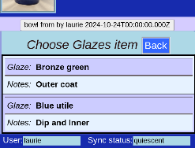
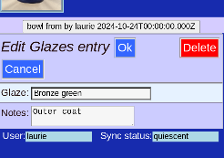

# Variable Length Lists

## Part of General information

This part if the [piece information](PotEdit.md) is more complex:

* Used for _Glazes_
* Zero or more entries
* Each entry can store information list _glaze type_ and _comments_ on application
* Separate screens for editing

## View

All the entries are seen within the List.

## Edit

The options change depending on the number of existing entries in the List.

With an empty list, the only option is __Add__

## List Add

Adding to a list shows the fields in this list entry. __Ok__ to continue.

## List Add or Modify

With at least one intry in the list, more options appear. Option to add another entry, or modify the current one.

## List Choose

With 2 or more, another option __Rearrange__ appears as well. If we want to edit one ot the entries, we will get a chance to choose which one:

Click on your entry choice to proceed.

## List Modify

Edit the entry, or even __Delete__ it entirely

## List Rearrange

You can also change the order the list entries appear in with the arrows.

## Save

After editing the List, you will return to the [full edit screen](PotEdit.md) to __Save Changes__

