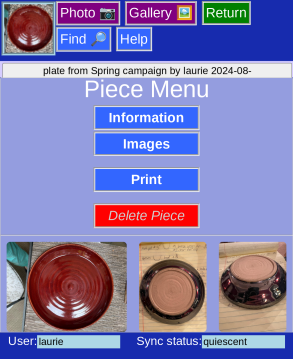
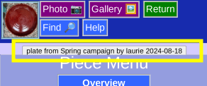
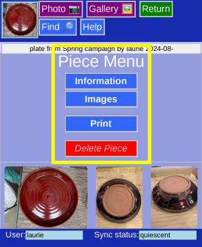
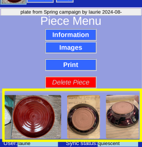

# Piece Menu

This is the menu of choices for a selected piece.

## Icon

The icon in the upper corner shows the current piece.

It's a thumbnail of the first picture in the list.

Clicking it will return the the [_Main Menu_](MainMenu.md)

## Take Picture

The Purple _Photo_ will bring up the camera or gallery of your device. The new picture will be added to the current piece.

## Info Bar

Information identifying the current piece.

## Navigation

Information about the piece is split into 3 sections:

* [_Information_](PotEdit.md) All data except images and their comments.
* [_Images_](PotPix.md) allows editing the images
* [_Print_](PotPrint.md) for printing the piece's information and pictures
* _Delete_ to delete this piece entirely! That includes data and pictures. You will be asked for confirmation.

## Pictures

Larger thumbnails of all the pictures of this piece. Clicking one brings up a [full screen image](LargeImage.md):

 
