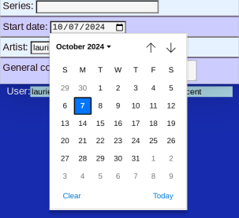

# New Piece

## Initial screen

Creating an entry for a new piece is easy. Only a little information is needed, and defaults are used for _date_ and _artist_.

You don't have to enter all the data now. You can [update the data later](PotEdit.md).

## Add Data

For _type_ and _series_ a list of previous entries are offered since the choice is often a repeat.

Other fields are free text or multiple choice.

The _date_ defaults to the current date. Use the date picker to change it.

## Save

Finally remember to _Save Changes_. (Either button)
