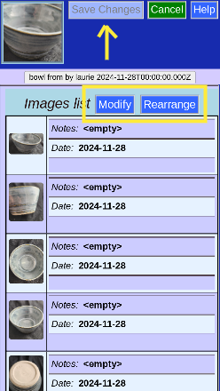
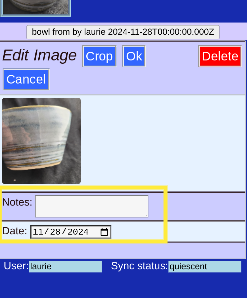
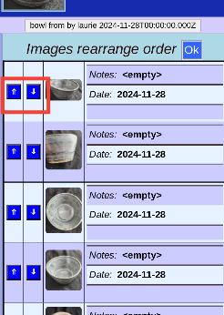
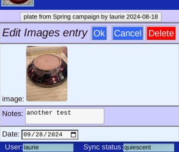
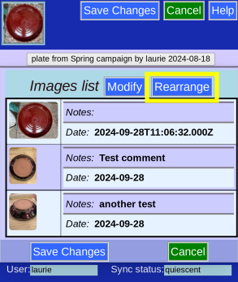

# Pictures

You can see, rearrange, and annotate the images associated with a piece. (Or even delete one).

### Current Pictures

The images list shows the all pictures for this piece.

The Thumbnail for this piece comes from the first picture in the list.

### Photo button

The purple _Photo_ button will add another picture to the start of the list and take you to this page.

## To Edit

Click _Edit_ to be able to alter the image list

### Editing

The choices available change

## Modify

To change a picture's information, you need to _modify_, and then select it from a list (if more than one).

### Select

Click on the row of the image you want to modify.

### Change

Alter the comment or data field if desired, then Click _Ok_ (or _Cancel_ to not change)

### Delete

You can delete the picture. (You will be asked for confirmation).

## Rearrange

You can rearrange the order of images. The first one will be used for the Thumbnail.

Use the arrows to move the entry up or down.

## Save Your Work

Changes will be recorded after clicking _Save Changes_.