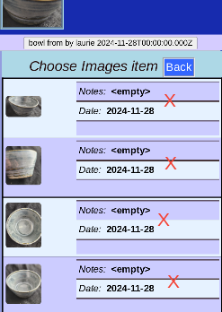

# Pictures

You can see, rearrange, and annotate the images associated with a piece. (Or even delete one).

## View Pictures

The images list shows the all pictures for this piece.

* The Thumbnail for this piece comes from the first picture in the list. (Circled)
* Add more images using the __Add Photo__ or __Add Gallery__ buttons.
* For Safety, we start in _View mode_ to avoid making unintentional changes.
* Edit, rearrange and delete by entering _Edit mode_ by:
  * Clicking the Edit button,
  * or Double-clicking the data

## Edit Pictures

The choices in _Edit mode_ include 

* __Modify__ (Add comments, Crop, or even delete)
* __Rearrange__ (Change the order, if more than one)

Note that the __Save Changes__ button is inactive until a change in the data is made.

### Modify -- Select

After choosing __Modify__, if there is more than one image, we need to select the one to work on. Just click on the entry you are targetting.

### Modify -- choices

Options for modifying are:

* Change the _Notes_ or _Date_ fields (then press __Ok__)
* [__Crop__](Crop.md) the image.
* __Delete__ the image

None of these options are permanent until __Save Changes__ on the main edit page.
 
## Rearrange

You can change the order of the pictures with __Rearrange__.
Use the up and down arrows to move a picture.
(They will wrap around top and bottom).

The first picture will be used as the identifying Thumbnail.

__Ok__ when done.

---
Changes will be recorded after clicking __Save Changes__ (either one).